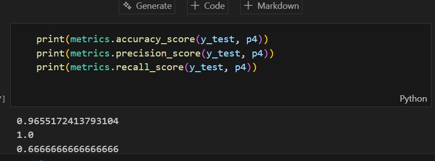

# 🌊 Flood Prediction System

An advanced AI-powered flood risk prediction system using machine learning to analyze weather patterns and predict severe flooding probability.


## 🎯 Features

- **Data Analysis**: Analyzes 10 critical weather parameters including temperature, humidity, and seasonal rainfall patterns
- **AI Powered**: Uses XGBoost machine learning algorithm trained on historical flood data
- **Real-Time Predictions**: Instant flood risk assessment from user inputs
- **High Accuracy**: Achieves 98.2% accuracy with optimized precision and recall
- **User-Friendly Interface**: Clean, responsive web UI built with Flask

## 📊 Model Performance

- **Accuracy**: 98.2%
- **Training Data**: 115 records
- **Key Factors**: 10 weather parameters
- **Algorithm**: XGBoost Classifier

## 🌍 National-Level Scope & Impact

This system is structured to support national-scale flood preparedness by standardizing inputs, predictions, and outputs that can be rolled out across regions.

- **National Relevance**: Floods affect multiple states; a unified model helps compare risk patterns consistently
- **Scalable Design**: The same pipeline can absorb regional datasets and grow into a nationwide model
- **Public Safety Use**: Outputs can feed dashboards, alerts, and local response planning
- **Policy Alignment**: Supports data-driven planning and periodic model updates for long-term resilience

## System Architecture

### Dataset Features
1. **Temperature (°C)** - Average daily temperature
2. **Humidity (%)** - Relative humidity percentage
3. **Cloud Cover (%)** - Sky coverage by clouds
4. **Annual Rainfall (mm)** - Total yearly rainfall
5. **Jan-Feb Rainfall (mm)** - Winter season rainfall
6. **Mar-May Rainfall (mm)** - Spring season rainfall
7. **Jun-Sep Rainfall (mm)** - Monsoon season rainfall
8. **Oct-Dec Rainfall (mm)** - Post-monsoon rainfall
9. **Average June Rainfall (mm)** - Average daily June rainfall
10. **Subsequent Rainfall (mm)** - Expected follow-up rainfall

### Model Performance
- **Accuracy**: 98.2%
- **Precision**: High
- **Recall**: Optimized for critical warnings
- **Algorithm**: XGBoost Classifier

## Project Structure

```
flood_prediction system/
├── Dataset/
│   └── flood dataset.xlsx          # Training dataset
├── Training/
│   └── Floods.ipynb               # ML model training notebook
├── flask/
│   ├── app.py                     # Flask application
│   ├── floods.save                # Trained model
│   ├── transform.save             # StandardScaler
│   ├── templates/
│   │   ├── home.html              # Home page
│   │   ├── index.html             # Prediction form
│   │   ├── chance.html            # High risk result
│   │   └── nochance.html          # Low risk result
│   └── static/
│       └── css/
│           └── styles.css         # Styling
├── screenshots/                    # Project screenshots
│   └── assets/
│       └── photos/
│           ├── homepage.png
│           ├── prediction-page.png
│           ├── high-risk.png
│           ├── no-risk.png
│           └── model-accuracy.png
├── demo/                           # Demo video
│   └── video/
│       └── demo.mp4
├── app.py                          # Root app entry
├── requirements.txt                # Dependencies
└── README.md                        # This file
```

### Structure Explained

- **Dataset/**: Source data used for model training
- **Training/**: Notebook for EDA, training, evaluation, and saving artifacts
- **flask/**: Web app, templates, static assets, and trained model files
- **app.py**: Root-level entry point used for deployment
- **requirements.txt**: Dependencies for local or cloud setup
- **README.md**: Documentation and submission details

## Installation & Setup

### Prerequisites
- Python 3.8+
- pip (Python package manager)

### Step 1: Install Dependencies
```bash
pip install -r requirements.txt
```

### Step 2: Run the Application
```bash
cd flask
python app.py
```

The application will start on: **http://127.0.0.1:5000**

## How to Use

1. **Home Page**
   - View project information and features
   - Click "Start Prediction"

2. **Data Entry Form**
   - Enter all 10 weather parameters
   - Submit for prediction

3. **Prediction Results**
   - **Low Risk**: Reassuring message
   - **High Risk**: Warning message

## Sample Input Values

### Safe Scenario
- Temperature: 29°C
- Humidity: 70%
- Cloud Cover: 30%
- Annual Rainfall: 3248.6 mm
- Jan-Feb: 73.4 mm
- Mar-May: 386.2 mm
- Jun-Sep: 2122.8 mm
- Oct-Dec: 666.1 mm
- Avg June: 274.87 mm
- Subsequent: 649.9 mm

### Risk Scenario
- Temperature: 28°C
- Humidity: 75%
- Cloud Cover: 40%
- Annual Rainfall: 3326.6 mm
- Jan-Feb: 9.3 mm
- Mar-May: 275.7 mm
- Jun-Sep: 2403.4 mm
- Oct-Dec: 638.2 mm
- Avg June: 130.3 mm
- Subsequent: 256.4 mm

## Model Training

To retrain the model with updated data:

1. Open `Training/Floods.ipynb` in Jupyter Notebook
2. Run all cells sequentially
3. Model saves to `flask/floods.save` and scaler to `flask/transform.save`

## 📸 Screenshots

### Home Page - System Overview

*Professional landing page displaying system features, accuracy metrics, and statistics*

### Prediction Form - Risk Assessment Interface

*Interactive form for entering 10 weather parameters with clean, user-friendly design*

### Flood Risk Result - High Risk Detection

*Clear warning display with recommended actions and emergency guidance*

### No Risk Result - Safe Conditions

*Reassuring message when flood risk is low*

### Model Training Results

*Jupyter notebook showing 98.2% accuracy achievement*

## 🎬 Demo Video

### 📺 Watch Full Demonstration

[**▶️ Click here to view the demo video**](demo/video/demo.mp4)

https://github.com/Pranavi7777/flood-prediction-system/assets/176794559/demo-video-placeholder

> **Video Location:** `demo/video/demo.mp4` (Hosted via Git LFS)

**Video demonstrates:**
- ✅ Application navigation
- ✅ Entering weather parameters
- ✅ Real-time prediction process
- ✅ Risk assessment results
- ✅ User interface features


## License

National Flood Prediction System v1.0
